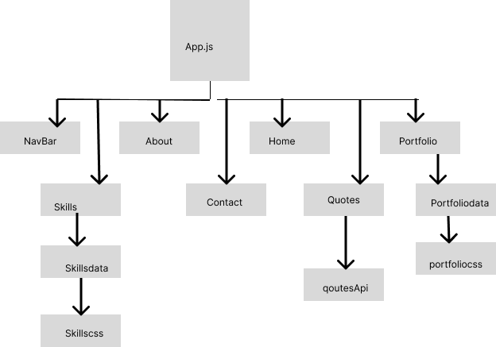

# Myportfolio
# DEMO-https://deepnair.netlify.app

# Table of Contents
# About The Project
   A React Application created using create-react-app, built using Api's ,tailwind and bootstrap framework.
## Built With
 

 

# Getting Started

# Installation
To get a local copy of the code, clone it using git in your local terminal:

git clone https://github.com/deeNair/myportfolioapp

cd myportfolioapp

open in VSCode, to see the code using :

code .

#### npm start
to open the react app http://localhost:3000 to view locally.

Also live on:
https://deepnair.netlify.app

# Development

## Wireframe:

# Features:
1.Website uses multiple react components.
2.Component navBar uses react scroll Link to navigate to different section also the navBar is fixed so its visible at all time.
3.Used a mp4 video as the landing page.
4.Used react marquee to have skills scrolling.
5.Used bootstrap cards to diaplay portfolio projects.
6.Used react-slick to display the quotesApi in a slider.

# Future Enhancements:
1.make the site responsive to all media.
2.work on more clean css.

# Acknowledgments
https://react-slick.neostack.com/docs/example/simple-slider/

https://mdbootstrap.com/docs/react/components/buttons/

https://www.figma.com/file/ttdbrKFpy6OrCo61Wkmjor/myportfolio?node-id=0-1&t=V4uC5ygFSHBg70xh-0